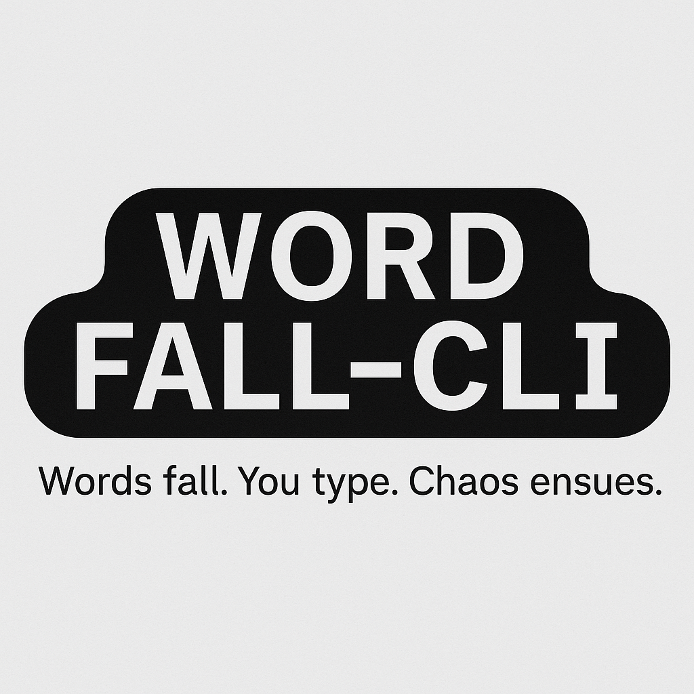

# ⬇️ wordfall-cli

<p align="center">
  
</p>

A smooth and engaging typing game right in your terminal.  
Words fall from the top—your mission: type them before they hit the ground!

---

## ✨ Features

- 🌀 Smooth falling word animation  
- 📈 Dynamic difficulty scaling based on your score  
- 🌐 Fresh words from an online API every 10 seconds  
- ⌨️ Real-time typing with responsive feedback  
- 💻 Designed for macOS and Linux terminals  

---

## 🚀 Requirements

- Python 3.7+  
- `curses` (built-in on macOS/Linux)  
- `requests` (install via pip)

```bash
pip install requests
```

---

## ▶️ Getting Started

1. Clone the repo:

```bash
git clone https://github.com/Demonmodez/wordfall-cli.git
cd wordfall-cli
```

2. Run the game:

```bash
python wordfall.py
```

---

## 🎮 How to Play

- Type the falling word and press `Enter` to eliminate it.  
- Miss a word and you lose a life.  
- Score increases with each correct word.  
- Word difficulty increases with score.  
- You start with 3 lives. Game over when you lose them all.  

---

## 📦 API Source

This game uses the [Random Word API](https://random-word-api.herokuapp.com/)  
Words update every 10 seconds to keep the gameplay fresh.

---

## 🤖 Fully AI-Generated

This entire project—code, logic, design, and documentation—was created entirely using **ChatGPT**.  
No manual code or typing was involved. 100% AI-generated, just for fun and learning 🧠💻

---

## 📹 Demo

_Coming soon_

---

## 🧠 Future Ideas

- Add sound effects  
- Save high scores  
- Add difficulty modes  
- Support for Windows via `windows-curses`  

---

## 📄 License

This project is licensed under the **MIT License**.  
You can do almost anything with it—just give credit and don't hold us liable!

See the [LICENSE](LICENSE) file for full details.

---

Made with ❤️ by [Jason Gerald](https://github.com/Demonmodez) — or rather, made *for* [Jason Gerald](https://github.com/Demonmodez) by ChatGPT 🌀
